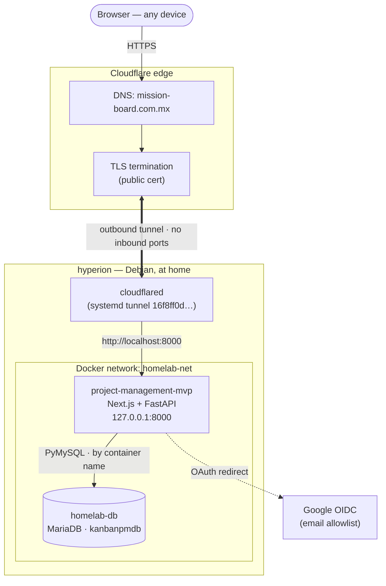

# Architecture

How Mission Board is hosted and exposed. Companion to [DATABASE.md](DATABASE.md)
(data model) and [SETUP.md](SETUP.md) (running it locally).

## Overview

Mission Board runs on **hyperion** (a Debian box at home) and is published to the
public internet at **`https://mission-board.com.mx`** — but with **no inbound
ports opened** on the home network. Traffic reaches the app through a
**Cloudflare Tunnel**: `cloudflared` on hyperion makes an *outbound* connection
to Cloudflare's edge, and Cloudflare forwards requests down that tunnel. The app
itself only listens on loopback, and every request is gated by Google sign-in.



## The pieces

### 1. Public entry — Cloudflare (DNS + edge)

`mission-board.com.mx` is managed in Cloudflare. Cloudflare answers DNS,
terminates **TLS with a real public certificate**, and hands the request to the
tunnel. Because TLS ends at the edge, the origin behind the tunnel can speak
plain HTTP over loopback — no certificate management on hyperion.

### 2. The tunnel — `cloudflared`

`cloudflared` runs as a **systemd service** on hyperion (`cloudflared.service`),
using tunnel id `16f8ff0d-374d-44cc-9e4f-fefdda31adba`. Config lives at
`~/.cloudflared/config.yml` (and `/etc/cloudflared/config.yml` for the service):

```yaml
tunnel: 16f8ff0d-374d-44cc-9e4f-fefdda31adba
credentials-file: /etc/cloudflared/16f8ff0d-374d-44cc-9e4f-fefdda31adba.json
ingress:
  - hostname: mission-board.com.mx
    service: http://localhost:8000
  - service: http_status:404
```

The key property: the tunnel is an **outbound** connection from hyperion to
Cloudflare. **Nothing is opened on the home router or LAN** — no port forwarding,
no exposed IP. A request that doesn't match the hostname falls through to a
`404`.

### 3. The app — Docker on loopback

The app is the Docker container **`project-management-mvp`** (a Next.js frontend
served by a FastAPI backend), started by
[`scripts/start-linux.sh`](../scripts/start-linux.sh):

- Published as **`127.0.0.1:8000`** — bound to **loopback only**, so it is not
  reachable from the LAN or the Tailscale tailnet. The tunnel is the only door.
- Attached to the **`homelab-net`** Docker network so it can reach the database
  container by name.

### 4. The database — shared MariaDB

Data lives in **`kanbanpmdb`** inside the shared **`homelab-db`** MariaDB
container (see [DATABASE.md](DATABASE.md)). The app connects with PyMySQL over
`homelab-net`, addressing the DB by its **container name** (credentials come from
the gitignored `.env`). Data persists in the `homelab-db` volume, so replacing
the app container never touches user data.

### 5. Authentication — Google OIDC

Sign-in is **Google OAuth (OIDC)** with an **email allowlist**: only emails added
under Users may sign in. Since the app is publicly reachable, this allowlist is
what keeps it private in practice.

## Why this shape (the security story)

- **No inbound ports.** The home network exposes nothing; the only channel is the
  outbound tunnel. There is no public IP or port-forward to attack.
- **TLS for free at the edge**, so no certificates to provision or renew on
  hyperion.
- **Loopback-bound origin.** Even inside the home, the app isn't on the LAN or
  tailnet — the tunnel is the single entry point.
- **Auth gate.** Public reachability is fine because Google + the allowlist gate
  every request.

## Contrast: the other personal app on hyperion

hopeland2 (the video gallery) uses a **different exposure model** on the same
box: it is served **privately over the Tailscale tailnet** via Tailscale Serve
(`https://hyperion.tailee366d.ts.net:5678`), reachable only from allowed
Tailscale devices — the work laptop is denied by a Tailscale ACL. It shares the
same Google-allowlist auth.

So the two apps illustrate two patterns:

| | Mission Board | hopeland2 |
|---|---|---|
| Reachability | **Public** (`mission-board.com.mx`) | **Private** (tailnet only) |
| Front door | Cloudflare Tunnel | Tailscale Serve |
| TLS | Cloudflare edge (public cert) | Tailscale (Let's Encrypt) |
| Ports opened | none (outbound tunnel) | none (tailnet only, loopback origin) |
| Auth | Google OIDC + email allowlist | Google OIDC + email allowlist |
